# CTA source intake and curation

[All CTA figures, vector PDF](pirlygenes-cta-curation-figures.pdf)

2,537 coding candidates; 624 pass the default rules, including the normal-reproductive-only nomination holdback.

Sources are upstream nominations, not antigen-validation claims. Complete memberships and exact intersections accompany every figure.

## Source Venn

[Vector PDF](cta-source-venn.pdf)

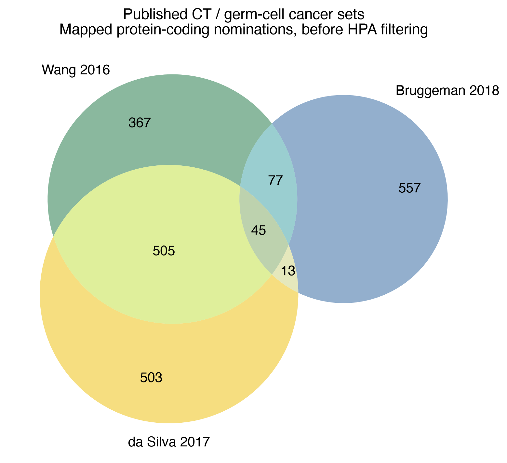

## Stage Funnel

[Vector PDF](cta-stage-funnel.pdf)

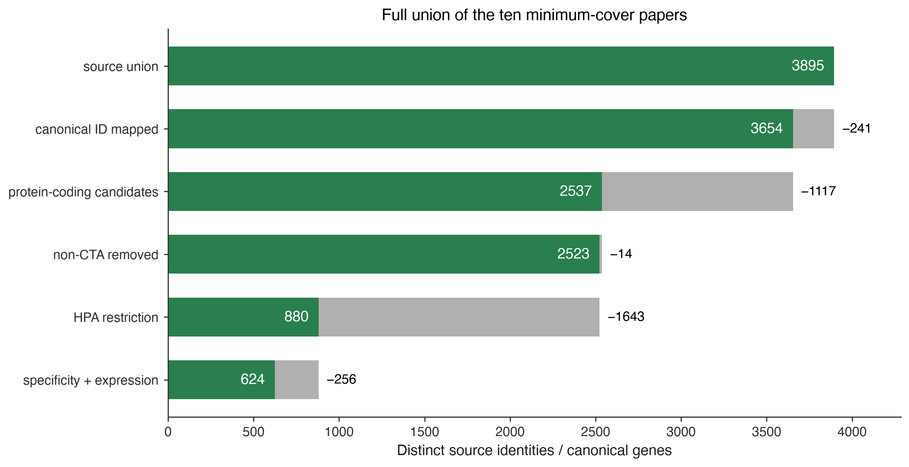

## Filter Funnel

[Vector PDF](cta-filter-funnel.pdf)

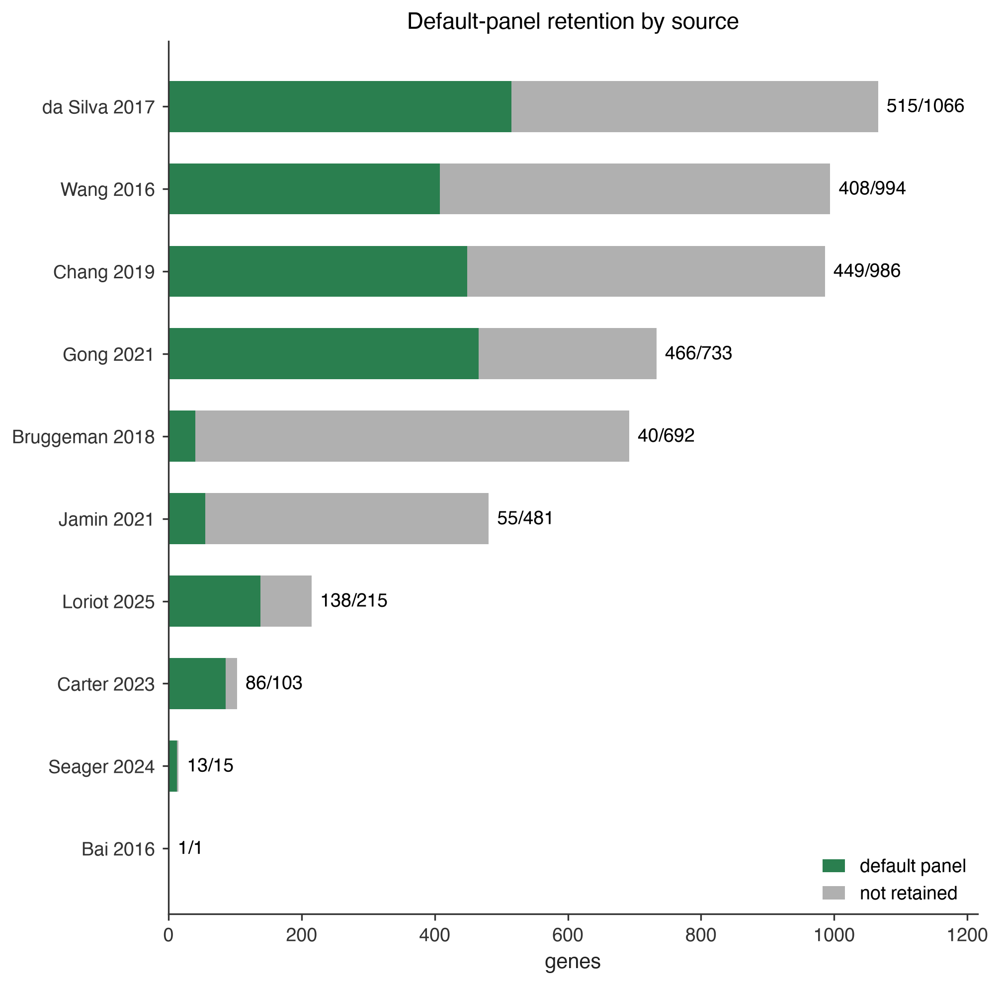

## Filter Outcome

[Vector PDF](cta-filter-outcome.pdf)

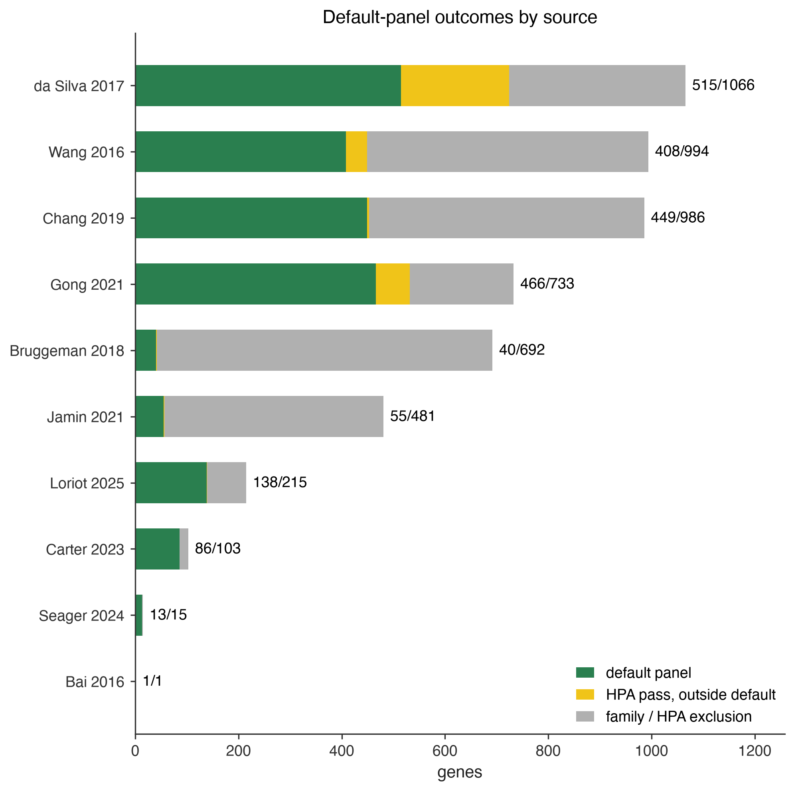

## Deflated Dist

[Vector PDF](cta-deflated-frac-dist.pdf)

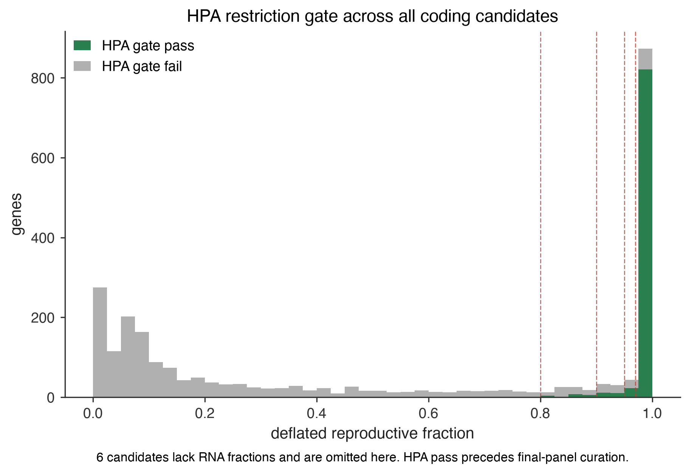

## Protein Vs Rna

[Vector PDF](cta-protein-vs-rna.pdf)

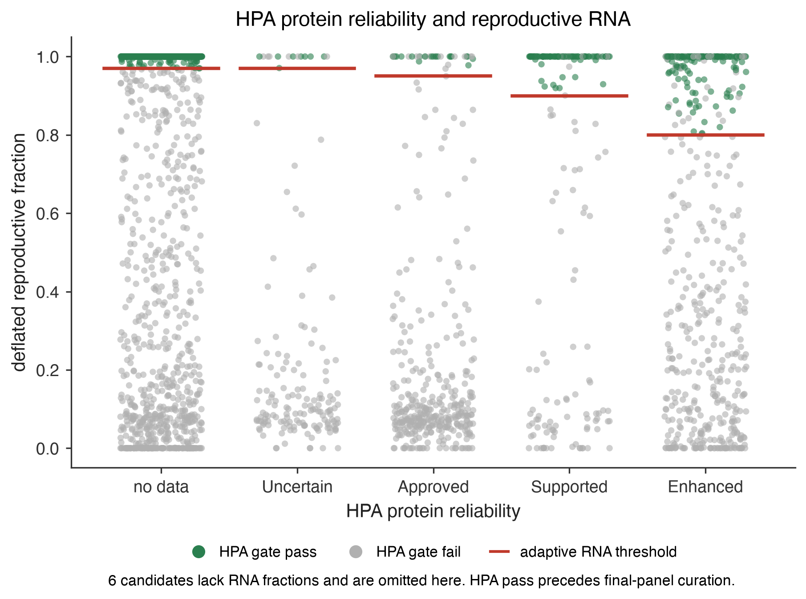

## Legacy Source Venn

[Vector PDF](cta-legacy-source-venn.pdf)

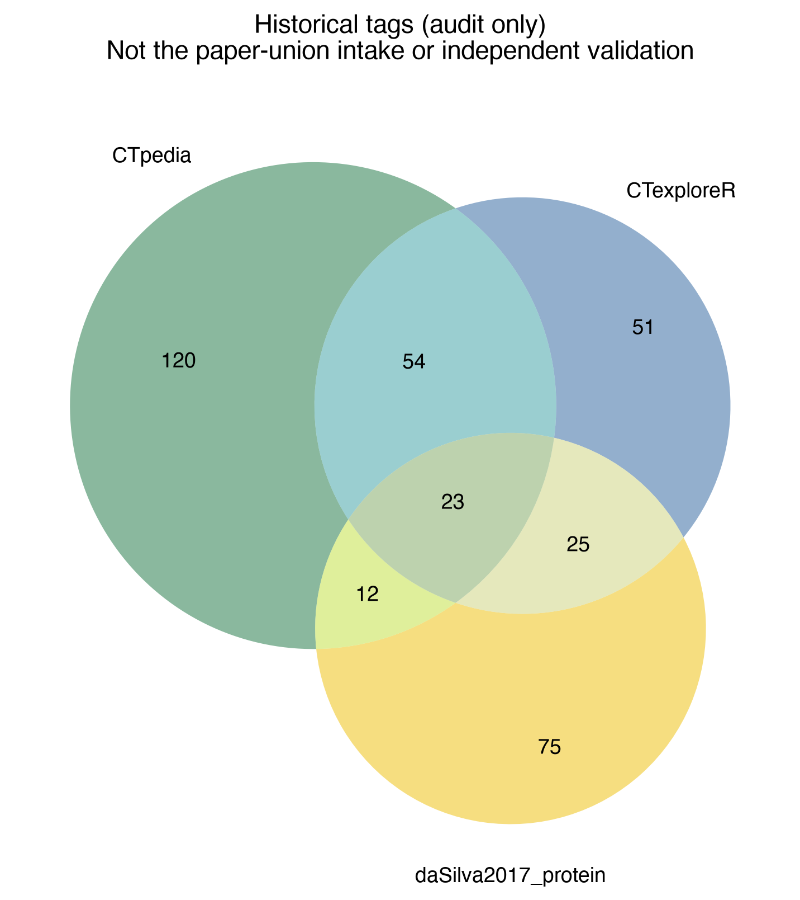

## Landscape Source Venn

[Vector PDF](cta-landscape-source-venn.pdf)

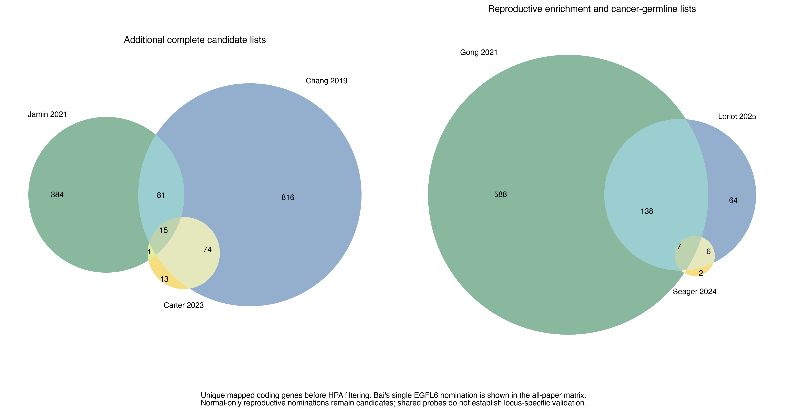

## Source Overlap

[Vector PDF](cta-source-overlap.pdf)

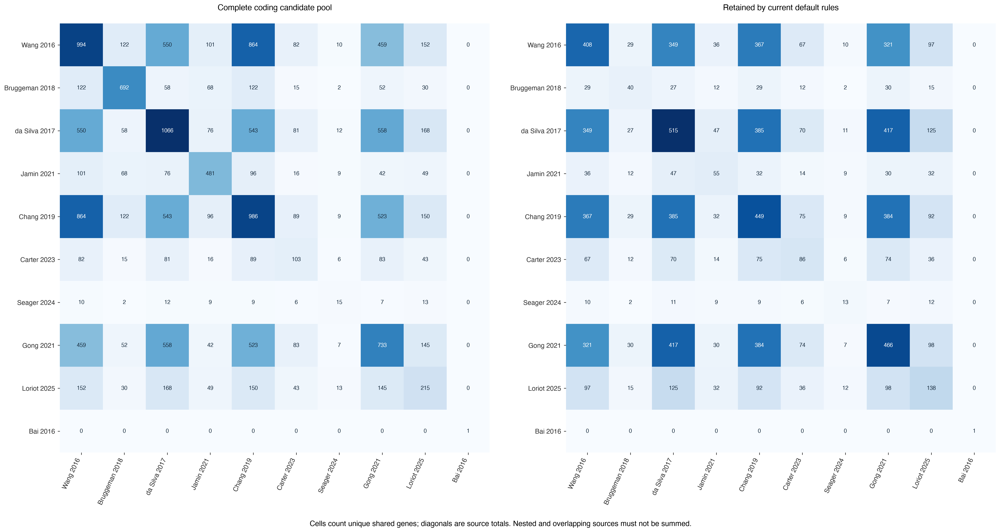

## Placental Source Overlap

[Vector PDF](cta-placental-source-overlap.pdf)

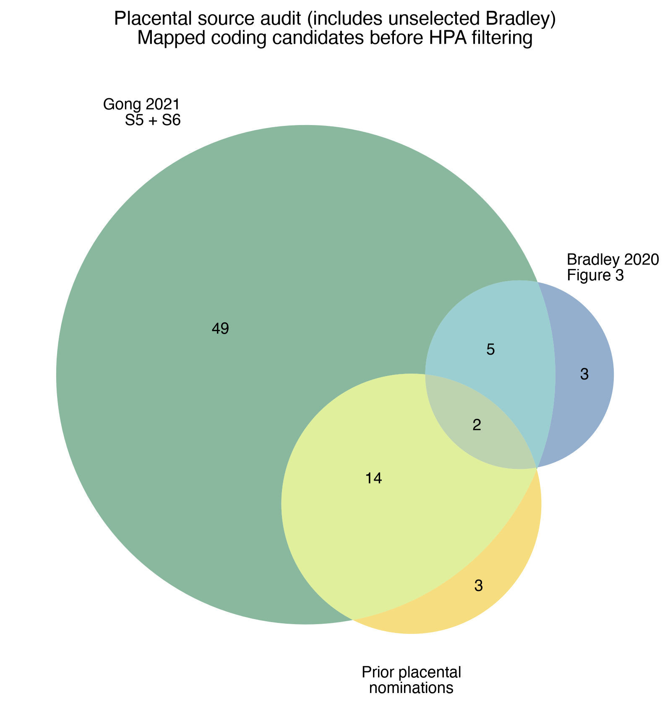

## Publication Funnel

[Vector PDF](cta-publication-funnel.pdf)

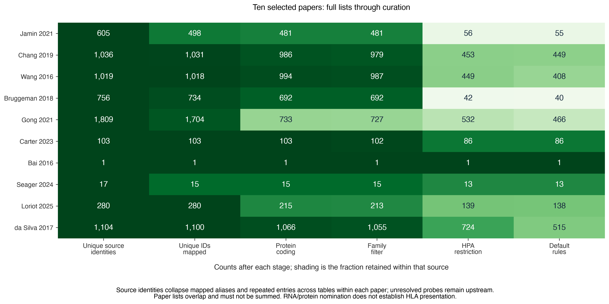

## Placental Evidence Coverage

[Vector PDF](cta-placental-evidence-coverage.pdf)

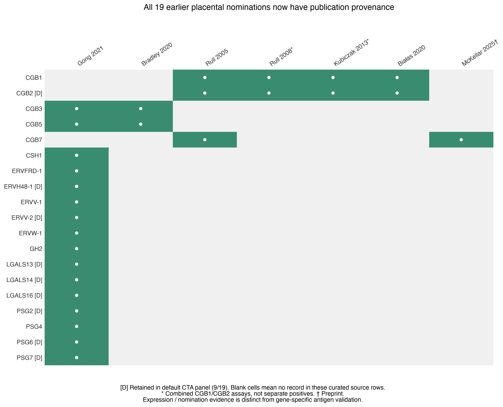
