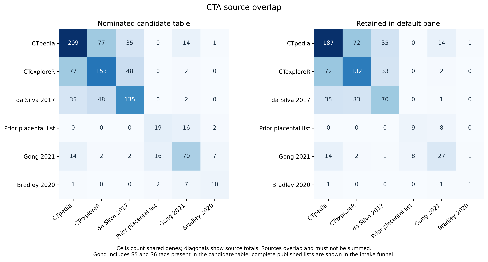
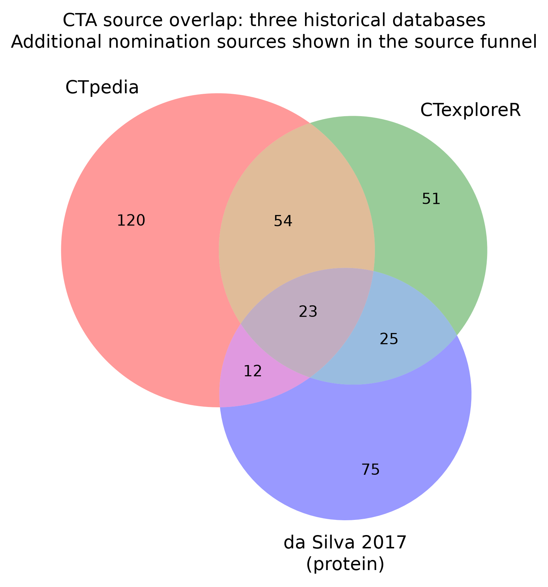
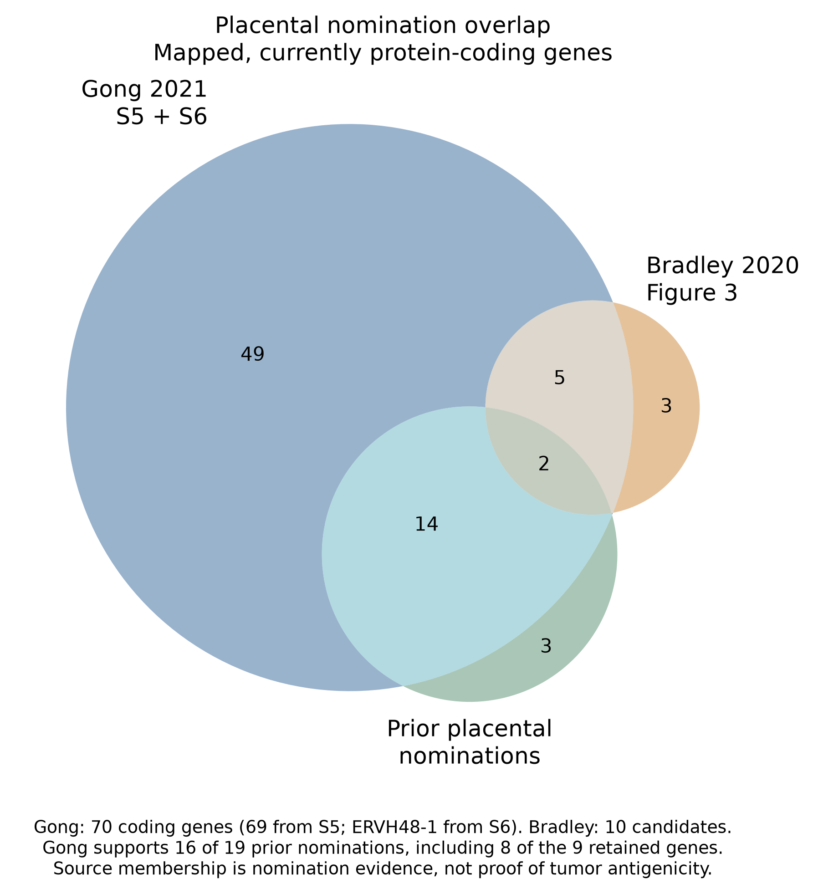
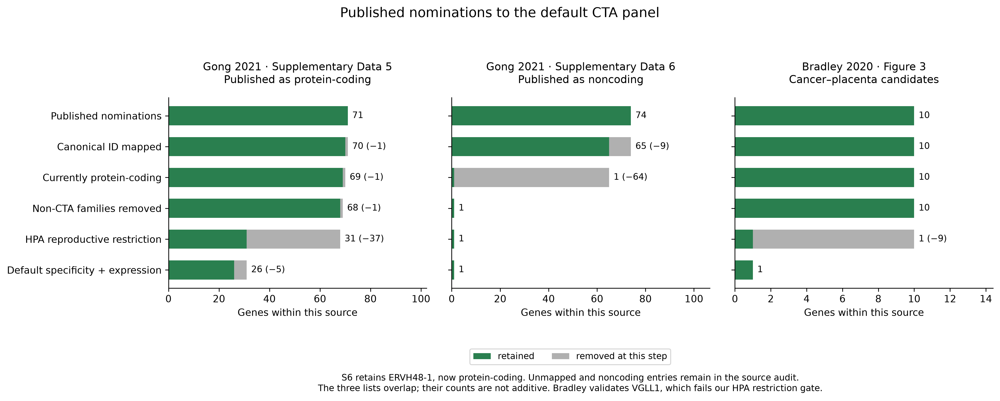
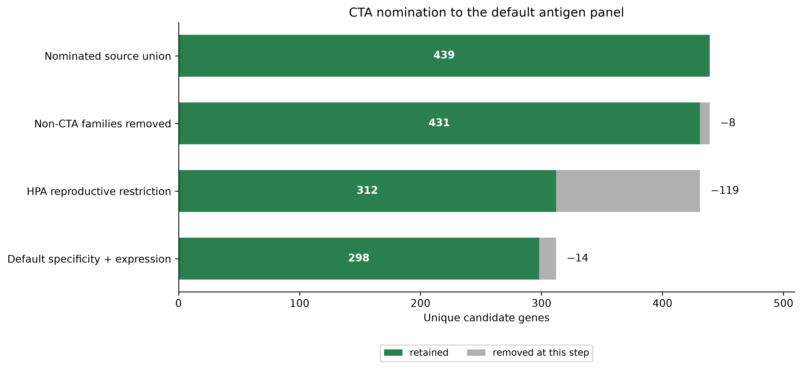
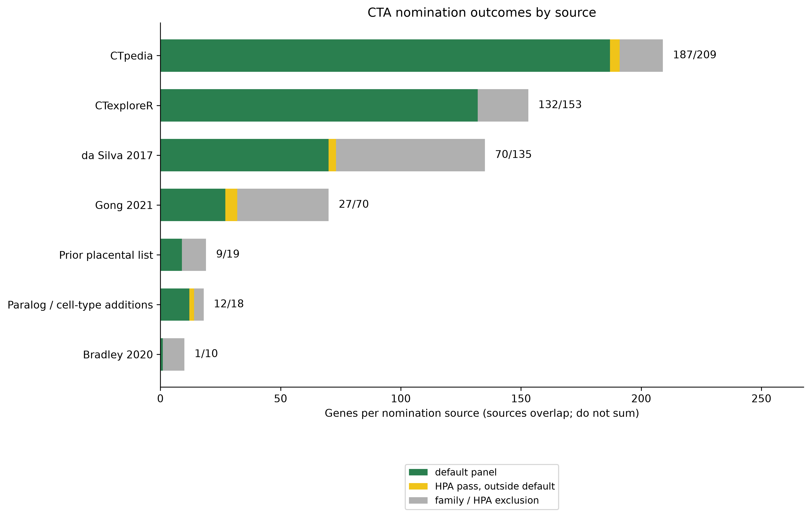
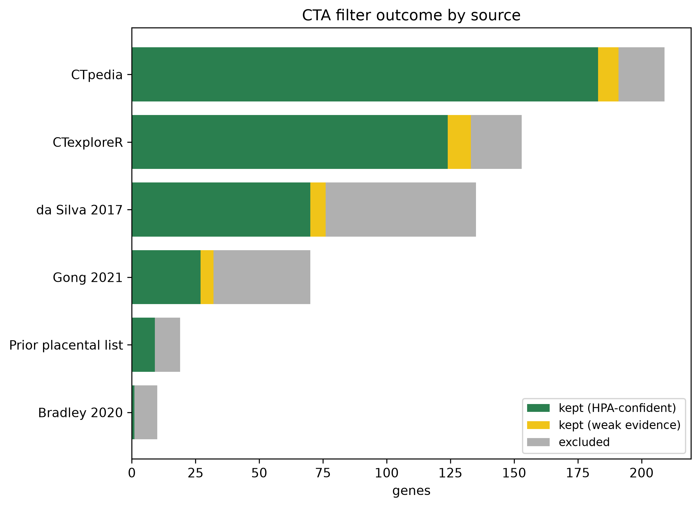
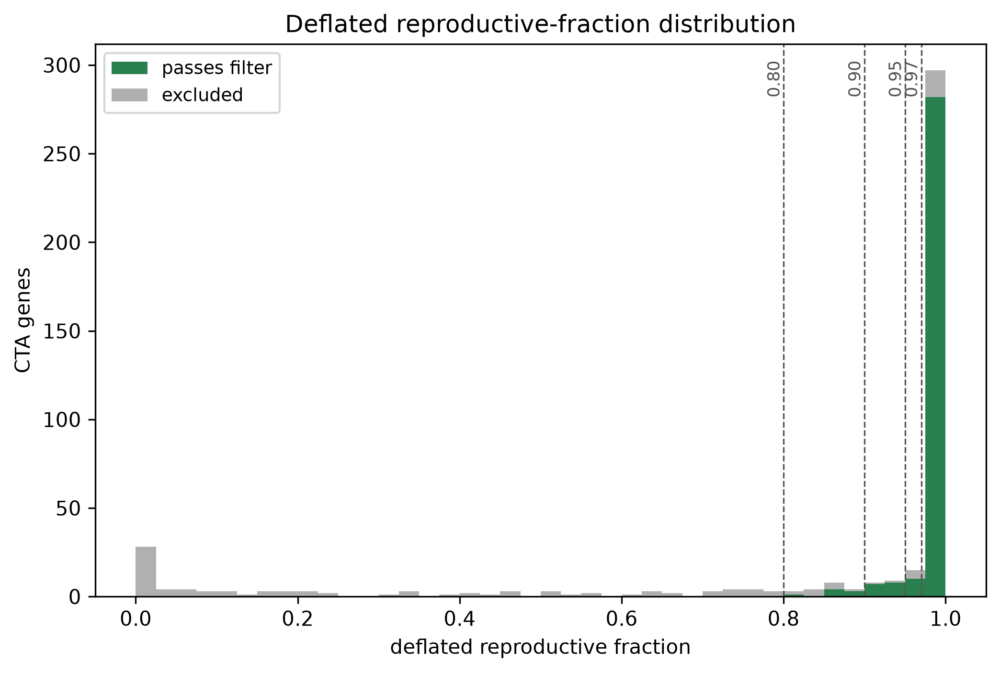
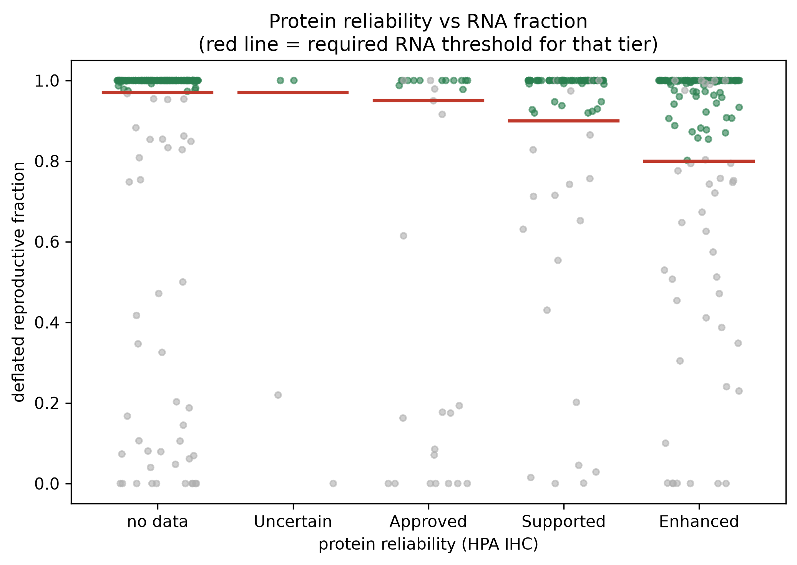
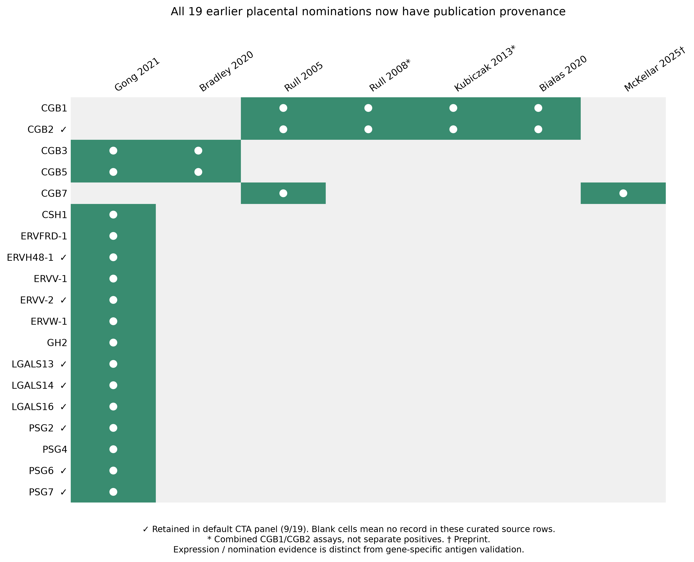

# Cancer-Testis Antigen (CTA) Curation

This document describes how the CTA gene set is built, filtered, and maintained.

## Overview

Cancer-testis antigens (CTAs) are proteins normally restricted to reproductive
tissues (testis, ovary, placenta) that become aberrantly expressed in tumors.
Their tissue restriction makes them attractive immunotherapy targets because
immune responses against them should spare normal somatic tissues.

The CTA candidate set combines published CT-antigen databases with supplementary
family-based and single-cell nominations. It is systematically filtered with
Human Protein Atlas tissue-expression data to keep
genes with reproductive-restricted expression. The rest of this document moves
from ownership and outputs to source evidence, filtering, maintenance, and API
details.

## Ownership and scope

As of #511, [oncoref](https://github.com/pirl-unc/oncoref) owns the canonical
CTA *gene set*. Pirlygenes re-exports its `CTA_gene_ids()` /
`CTA_gene_names()` and restriction-subset accessors.

The CTA *evidence* frame (`CTA_evidence()`) remains sourced from
[tsarina](https://github.com/pirl-unc/tsarina) because it carries the `ms_*`
mass-spec healthy-tissue safety layer that oncoref does not. Pirlygenes treats
that frame as an evidence-enrichment join on the oncoref set. Tsarina 1.23.1
converged its default set onto oncoref's, so the two agree gene-for-gene (see
pirl-unc/pirlygenes#546). The reproductive-restriction methodology below is
shared by both packages.

## Figures

These figures are generated from oncoref's raw `cancer-testis-antigens` table
and public CTA membership accessors by
`pirlygenes.cta_curation_plots`, exposed as a CLI command:

```bash
pirlygenes plot cta-curation --out <dir>
```

They also refresh together with every other analyses plot via the batch driver —
`python analyses/regenerate_plots.py --promote-docs` rebuilds them (calling the
same packaged code) and copies the results back into this directory.

### Source overlap

These figures use the released `oncoref==1.8.204` source authority, including
Gong/Bradley nominations and primary CGB1/CGB2/CGB7 evidence. Install the pinned
pirlygenes release and run `pirlygenes plot cta-curation --out <dir>` to reproduce
the source overlaps and funnels. PNG exports are at least 300 dpi and every
figure has a vector PDF sibling.



The historical three-database comparison is retained for reference:



### Published placental nominations





The intake funnels retain the full published denominators, including unmapped
and currently noncoding genes. The overlap Venn uses mapped, currently
protein-coding identities. A publication nominates candidates; it does not
override our normal-tissue restriction or default specificity policy.

### Sequential nomination funnel

The funnel starts before oncoref's non-CTA family exclusions and ends at the
exact public `CTA_gene_ids()` set. With the Gong/Bradley source additions:
**439 nominated genes → 431 after family exclusions → 312 after HPA restriction
→ 298 default CTAs**. The released oncoref 1.8.196 snapshot was
397 → 390 → 302 → 293. The last step includes expression/rescue and specificity
policy. These are gene counts, before identical-protein grouping, and do not
imply peptide presentation or patient eligibility.

Each run exports `cta-stage-counts.csv`, `cta-stage-membership.csv`, and
`placental-nomination-provenance.csv` beside PNG and vector PDF figures.
The updated source run also exports publication citations, full source-row
intake membership/counts, pairwise overlap counts and the Venn membership.
The source-level funnel distinguishes default inclusion from raw HPA passage;
source lists overlap and must not be added together.



### Filter funnel by source


### Filter outcome by source


### Deflated reproductive fraction distribution


### Protein reliability vs RNA fraction


## Source databases

The intake counts below describe historical source batches. For the current
pinned historical sources, the generated source funnel has: CTpedia 209 candidates / 187
default CTAs, CTexploreR 153 / 132, da Silva protein subset 135 / 70, placental
nominations 19 / 9, and other paralog/cell-type additions 18 / 12. The newly
added Gong and Bradley sources contribute 70 / 27 and 10 / 1 respectively.
Together they add 42 candidates and five default genes: **INSL4, GCM1, CYP19A1,
HTRA4 and KISS1**. Existing candidate evidence and filter decisions are preserved. Database
sources overlap; these numbers are not additive.

### Gong et al. 2021: placental RNA enrichment

[Gong et al., *Nature Communications* (2021)](https://doi.org/10.1038/s41467-021-22695-y),
*The RNA landscape of the human placenta in health and disease*, supplies
71 placenta-enriched protein-coding genes in **Supplementary Data 5** and
74 placenta-enriched noncoding entries in **Supplementary Data 6**. Both full
lists are retained in oncoref's `cta-publication-membership` table, with original
symbols/Ensembl IDs, source annotations and canonical mapping outcomes.

| Source | Published | Mapped | Currently coding | After family exclusions | HPA pass | Default |
|---|---:|---:|---:|---:|---:|---:|
| Gong S5 | 71 | 70 | 69 | 68 | 31 | 26 |
| Gong S6 | 74 | 65 | 1 | 1 | 1 | 1 |
| Bradley Figure 3 | 10 | 10 | 10 | 10 | 1 | 1 |

ERVH48-1 is preserved as historically noncoding in S6 but currently
protein-coding. Conversely, DSCR4 was coding in S5 and is currently lncRNA;
TXNRD3NB is unmapped. Nine further S6 entries are unmapped. These rows stay in
the provenance table without being newly admitted as protein CTA candidates.
Gong supports **16 of the 19 prior placental nominations and 8 of the 9 retained
genes**; it does not cover CGB1, CGB2 or CGB7. Placental enrichment itself is not
evidence of tumor expression, peptide presentation or T-cell recognition.

### Bradley et al. 2020: cancer-placenta candidates

[Bradley et al., *Nature Communications* (2020)](https://doi.org/10.1038/s41467-020-19141-w),
*Vestigial-like 1 is a shared targetable cancer-placenta antigen expressed by
pancreatic and basal-like breast cancers*, provides the **Figure 3** set:
**VGLL1, PLAC1, CGB3, CGB5, IGF2BP3, DEPDC1B, ADAM12, SLC38A9, CAPN6 and MMP11**.
Seven overlap Gong's coding nominations. The paper provides HLA-peptide and
antigen-specific T-cell validation for **VGLL1**; the ten-gene source list is not
a claim that all ten received that validation.

Only PLAC1 passes the current default gate. VGLL1 remains in the sourced
candidate table with its validation provenance, but fails the existing HPA
normal-tissue restriction gate. Adding its paper does not waive that gate.

Oncoref owns `cta-publication-sources`, `cta-publication-membership` and the
reproducible `scripts/import_cta_publications.py` importer. Source tags are
`Gong2021_placenta_PC`, `Gong2021_placenta_ncRNA` and `Bradley2020_CPA`.
The source registry records exact tables/figures, DOI, evidence scope and input
checksums. HPA v23 annotations are generated only for new candidates; unavailable
RNA does not count as absent expression, and unknown canonical transcript IDs
remain unassigned.

### CTpedia (167 genes)

The [CTdatabase/CTpedia](http://www.cta.lncc.br/) is the foundational CT antigen reference, maintained by the Ludwig Institute for Cancer Research.

- **Publication**: [Almeida et al. 2009, *Nucleic Acids Research*](https://doi.org/10.1093/nar/gkn673)
- **Content**: ~279 CT gene families curated from literature, with expression data, immune response data, and PubMed links
- **Our subset**: 167 genes from CTpedia that had HPA tissue antibody staining restricted to testis and placenta (original pirlygenes CTA list)

### CTexploreR / CTdata (62 new genes)

[CTexploreR](https://www.bioconductor.org/packages/release/bioc/html/CTexploreR.html) is a modern Bioconductor R package providing a curated, actively maintained CT gene list based on GTEx, CCLE, TCGA, and ENCODE data.

- **Publication**: [Loriot et al. 2025, *PLOS Genetics*](https://doi.org/10.1371/journal.pgen.1011734)
- **Content**: 280 genes classified as CT_gene (146, testis-specific) or CTP_gene (134, testis-preferential)
- **Classification criteria**: Testis-specific genes must have low expression in all somatic tissues and >=10x higher expression in testis. Testis-preferential genes must have low expression in >=75% of somatic tissues with >=10x testis enrichment. Both must show activation in cancer cell lines (CCLE) and tumors (TCGA).
- **Our subset**: 62 protein-coding CTexploreR genes not already in CTpedia that pass our HPA filter. Source tagged as `CTexploreR_CT` or `CTexploreR_CTP`.
- **GitHub**: [UCLouvain-CBIO/CTdata](https://github.com/UCLouvain-CBIO/CTdata)

### da Silva et al. 2017 protein-level CT genes (89 new genes)

[da Silva et al. 2017](https://doi.org/10.18632/oncotarget.21715) performed genome-wide identification of CT genes using RNA-seq across multiple normal tissue datasets and validated a subset at the protein level using tumor mass spectrometry proteomics.

- **Publication**: [da Silva et al. 2017, *Oncotarget*](https://doi.org/10.18632/oncotarget.21715)
- **Full predicted set**: 1,103 testis-biased genes (proportional score >= 0.9)
- **Protein-level subset**: 136 genes detected by mass spectrometry in tumor samples (melanoma, colorectal, breast, prostate, ovary — 209 samples total). These are genes with direct evidence of protein expression in tumors.
- **Our subset**: 135 of the 136 protein-level genes (1 excluded: SPATA8 reclassified as lncRNA in Ensembl 112). 46 overlap existing genes, 89 new. Source tagged as `daSilva2017_protein`.
- **Note**: The full 1,103-gene set uses a broad 0.9 proportional score threshold. The paper also describes a stricter 0.99 threshold (478 genes) and S-score tumor expression filter (418 genes), but these subsets are not provided as downloadable supplementary data. We use only the 136 protein-level genes, which represent the highest-confidence subset with direct proteomic evidence.

### EWSR1-FLI1 CT gene binding sites (12 genes)

CT genes identified as having EWSR1-FLI1 transcription factor binding sites in Ewing sarcoma.

- **Publication**: [Gallegos et al. 2019, *Molecular and Cellular Biology*](https://doi.org/10.1128/MCB.00138-19)
- **Content**: 40 CT genes from Table 2. 15 already in CTpedia, 12 new additions, 13 broadly expressed (excluded).

### Literature scan (28 genes)

Testis-specific genes from meiosis, piRNA pathway, and spermatogenesis literature that pass the HPA reproductive-tissue filter. These include well-characterized testis-specific gene families not captured by the databases above:

- Synaptonemal complex: SYCP3, SMC1B, RAD21L1, SYCE2, MEIOB, FKBP6
- piRNA pathway: PIWIL1, MAEL, DDX4
- Spermatogenesis: BRDT, LDHC, BOLL, NANOS2, ZPBP, ZPBP2, CALR3, ACTL7A, ACTL7B, DMRTB1
- Pluripotency: DPPA3, DPPA5, UTF1
- Known CT antigens: MAGEA8, MAGEA12, MAGEB10, GAGE1, PASD1, TEX14

### Where the placental nominations came from

`placental_antigen` is an internal nomination-provenance tag, not a separate
external database and not a final tissue-restriction verdict. The initial
family-based additions were made in
[tsarina #111](https://github.com/pirl-unc/tsarina/commit/ddad873f01738eeb061a4d365ff51a4072748454)
on June 10, 2026: hCG-beta/CGB, pregnancy-specific glycoproteins (PSG),
syncytin/ERV envelope genes, placental galectins, and placental lactogen/GH.
They were passed through the same HPA reproductive-restriction filters as the
other candidates. The seed script contains those gene/ENSG nominations; it does
not supply a structured per-gene literature citation for this group.

LGALS16 was subsequently nominated by the HPA trophoblast/single-cell scan in
[tsarina #125](https://github.com/pirl-unc/tsarina/commit/8aef2046fd08d44da2440033d2d565993661f701).
Oncoref imported the candidate table in
[oncoref #18](https://github.com/pirl-unc/oncoref/commit/698830e57c4fc5ee1e832b551debbcf5273baa4e)
and added LGALS16 in
[oncoref #115](https://github.com/pirl-unc/oncoref/commit/604051667c9b5ca63f3b6ec7635123d3a7353a65).
Oncoref now owns the set and its HPA-derived filter decisions.

In the pinned 1.8.204 table, 19 genes have this source tag. Nine are in the
default set: **CGB2, PSG2, PSG6, PSG7, ERVH48-1, ERVV-2, LGALS13, LGALS14,
LGALS16**. This source group is different from the public
`CTA_placental_restricted_gene_names()` subset: for example, CGB2's RNA
restriction is testis, and CGB8 already has CTpedia/daSilva source tags instead
of `placental_antigen`. The separate `placental_immune_privilege.py` panel is a
broader mechanistic gene list, not the source of CTA membership.

## Other CT databases considered

Several additional databases were evaluated but not used as primary sources:

| Database | Genes | Why not included directly |
|---|---|---|
| [da Silva et al. 2017](https://doi.org/10.18632/oncotarget.21715) full set | 1,103 | Broad 0.9 threshold; only the 136 protein-level subset used |
| [Wang et al. 2016](https://doi.org/10.1038/ncomms10499) | 876 | Genome-wide screen; supplementary gene lists overlap with other sources |
| [Bruggeman et al. 2018](https://doi.org/10.1038/s41388-018-0357-2) | 756 | Germ cell-specific genes; broader than classic CTA definition |
| [MSigDB YOKOE set](https://www.gsea-msigdb.org/gsea/msigdb/cards/YOKOE_CANCER_TESTIS_ANTIGENS) | 35 | Small, fully covered by CTpedia |
| [HPA testis-elevated](https://www.proteinatlas.org/humanproteome/tissue/testis) | 1,994 | Testis-elevated, not CTA-specific |

Genes from these sources are cross-referenced in the `source_databases` column (e.g., `daSilva2017` tag indicates the gene appears in the da Silva full 1,103-gene set).

## HPA tissue expression annotation

Every gene is scored against [Human Protein Atlas](https://www.proteinatlas.org/) v23 using two data modalities:

### RNA expression

**Data source**: [HPA RNA tissue consensus](https://www.proteinatlas.org/about/download) (`rna_tissue_consensus.tsv`)

This dataset provides normalized transcripts per million (nTPM) values across **50 normal human tissues**, representing a consensus of RNA-seq data from HPA, GTEx, and FANTOM5.

**Core reproductive tissues**: testis, ovary, placenta

**Thymus exclusion**: Thymus is excluded from all restriction calculations because AIRE (autoimmune regulator) drives ectopic expression of tissue-restricted antigens in medullary thymic epithelial cells (mTECs) as part of central immune tolerance. CTA expression in thymus is expected and does not indicate somatic tissue leakage.

**Deflated reproductive fraction**: To suppress low-level basal transcription noise, we compute a deflated metric:

```
deflated_fraction = (1 + sum_reproductive(max(0, nTPM - 1))) / (1 + sum_all(max(0, nTPM - 1)))
```

- `max(0, nTPM - 1)` zeros out sub-1 nTPM values (below HPA's own detection threshold)
- The `+1` pseudocount on numerator and denominator prevents 0/0 for very-low-expression genes where all tissues have nTPM < 1
- Thymus is excluded from the denominator (sum_all)

**Example**: CTCFL/BORIS has testis nTPM = 10.8 but ~40 other tissues at 0.1-0.9 nTPM each. Raw reproductive fraction: 54%. Deflated fraction: 100% (only testis exceeds 1 nTPM, so all other tissues contribute 0 after deflation).

### Protein expression

**Data source**: [HPA normal tissue IHC](https://www.proteinatlas.org/about/download) (`normal_tissue.tsv`)

This dataset provides immunohistochemistry (IHC) staining levels across **63 normal human tissues** with antibody reliability scores.

**Detection levels**: Not detected, Low, Medium, High

The IHC allowed-tissue rule uses oncoref's broader reproductive set: core tissues,
accessory reproductive tissues and breast, with thymus excluded from restriction
assessment. The deflated RNA numerator still uses only testis, ovary and placenta.
A protein-rule pass therefore does not imply confinement to those three tissues.

**Antibody reliability** (highest to lowest confidence):
- **Enhanced**: Orthogonal validation (mass spectrometry, Western blot, or similar)
- **Supported**: Staining consistent with gene/protein characterization
- **Approved**: Basic validation passed (at least one cell type detected as expected)
- **Uncertain**: Contradictory or unreliable staining pattern

A gene's `protein_reproductive` flag is True when all tissues with detected protein (excluding thymus) are in {testis, ovary, placenta}. The `protein_reliability` column reports the best (highest confidence) reliability score across all antibodies for that gene.

## Filter logic

The `passes_filters` column uses tiered deflated RNA reproductive fraction thresholds that scale with protein data confidence. Higher-confidence protein data in reproductive tissues provides corroborating evidence, allowing a more permissive RNA threshold:

| Protein evidence | Required deflated RNA fraction |
|---|---|
| Enhanced (orthogonal validation) + reproductive only | >= 80% |
| Supported (consistent characterization) + reproductive only | >= 90% |
| Approved (basic validation) + reproductive only | >= 95% |
| Uncertain or no protein data available | >= 97% |

**Additional filter criteria**:
- Gene must be protein-coding (Ensembl biotype = `protein_coding`)
- Genes with protein detected in **non-reproductive tissues** (excluding thymus) always fail, regardless of RNA fraction
- Thymus is excluded from both RNA and protein restriction checks

## Never-expressed flag

The `never_expressed` column flags genes where:
- No HPA protein (IHC) data is available, AND
- Maximum RNA nTPM across all tissues is < 2

When all RNA values are below 1 nTPM, the pseudocount yields a deflated fraction
of 1.0. The low-evidence flag does not itself guarantee filter passage or default
inclusion, and it is not proof that a gene is never expressed in tumors. In the
current 439-row owner table, 34 genes carry this flag; 30 pass the raw HPA gate,
and 16 survive the complete default policy, including literature/expression
rescue rules. The separate funnel applies family exclusions before HPA gates.

## Gene symbol maintenance

Gene symbols are updated to current HGNC nomenclature, with old symbols preserved in the `Aliases` column. Known renames:

| Old symbol | Current symbol | Reason |
|---|---|---|
| TSPY9P | TSPY9 | Reclassified from pseudogene to protein-coding |
| ODF3 | ODF3 (alias: CIMAP1A) | Renamed in Ensembl 112 |
| TEX33 | TEX33 (alias: CIMIP4) | Renamed in Ensembl 112 |
| TEX37 | TEX37 (alias: SPMIP9) | Renamed in Ensembl 112 |
| THEG | THEG (alias: SPMAP2) | Renamed in Ensembl 112 |
| C17orf104 | TLCD3A | HGNC rename |
| CCDC155 | KASH5 | HGNC rename |
| FAM71E2 | GARIN4 | HGNC rename |
| HIST1H1A | H1-1 | Histone nomenclature update |
| HIST1H1T | H1-6 | Histone nomenclature update |
| HIST1H2BA | H2BC1 | Histone nomenclature update |
| HIST1H2BB | H2BC3 | Histone nomenclature update |
| HIST1H4F | H4C6 | Histone nomenclature update |

Gene IDs are mapped to oncoref's canonical Ensembl reference. Historical
annotations remain in the publication-membership table. Existing transcript
annotations are preserved; the 42 new candidates do not yet have curated
`Canonical_Transcript_ID`, full-name or function annotations. Those fields remain
missing rather than being inferred from the nomination papers.

## Column reference

| Column | Description |
|---|---|
| `Symbol` | Current HGNC gene symbol |
| `Aliases` | Previous/alternative gene symbols (semicolon-separated) |
| `Full_Name` | Gene full name |
| `Function` | Functional annotation |
| `Ensembl_Gene_ID` | Ensembl gene ID (validated against release 112) |
| `source_databases` | Source databases (CTpedia, CTexploreR_CT, CTexploreR_CTP, daSilva2017, daSilva2017_protein) |
| `protein_reproductive` | IHC restriction under the broader allowed reproductive-tissue rule, or `"no data"` |
| `protein_thymus` | IHC detected in thymus |
| `protein_reliability` | Best HPA antibody reliability (Enhanced / Supported / Approved / Uncertain / `"no data"`) |
| `rna_reproductive` | No detected somatic tissue under the broader somatic-exclusion scope; distinct from the core RNA fraction |
| `rna_thymus` | Thymus nTPM >= 1 |
| `protein_strict_expression` | Semicolon-separated tissues with IHC detection (excl. thymus) |
| `rna_reproductive_frac` | Fraction of total nTPM (excl. thymus) in core reproductive tissues |
| `rna_reproductive_and_thymus_frac` | Same, with thymus added to numerator and denominator |
| `rna_deflated_reproductive_frac` | `(1 + sum_repro(max(0, nTPM-1))) / (1 + sum_all(max(0, nTPM-1)))` |
| `rna_deflated_reproductive_and_thymus_frac` | Same, with thymus added to reproductive numerator |
| `Canonical_Transcript_ID` | Preserved transcript annotation; missing for the 42 new candidates |
| `biotype` | Ensembl gene biotype (must be `protein_coding` to pass filter) |
| `rna_max_ntpm` | Maximum nTPM across all tissues |
| `rna_80_pct_filter` | Deflated reproductive fraction >= 80% |
| `rna_90_pct_filter` | Deflated reproductive fraction >= 90% |
| `rna_95_pct_filter` | Deflated reproductive fraction >= 95% |
| `rna_98_pct_filter` | Deflated reproductive fraction >= 98% |
| `rna_99_pct_filter` | Deflated reproductive fraction >= 99% |
| `passes_filters` | Raw HPA gate; family/default specificity policy is applied separately |
| `filtered` | Historical alias for `passes_filters` |
| `never_expressed` | No HPA protein data AND max RNA nTPM < 2 |

## Python API

```python
from pirlygenes.gene_sets_cancer import (
    CTA_gene_names,                # expressed + filtered CTAs (recommended default)
    CTA_gene_ids,                  # same, as Ensembl gene IDs
    CTA_never_expressed_gene_names,# filter-passing but no HPA expression
    CTA_filtered_gene_names,       # all filter-passing (= expressed + never_expressed)
    CTA_excluded_gene_names,       # CTAs that FAIL filter (somatic expression)
    CTA_unfiltered_gene_names,     # full CTA universe (all source databases)
    CTA_evidence,                  # full DataFrame with all evidence columns
    CTA_partition,                 # partition ALL protein-coding genes
)

# Default: expressed, reproductive-restricted CTAs
cta_genes = CTA_gene_names()

# Full CTA universe (for excluding from non-CTA comparison sets)
all_ctas = CTA_unfiltered_gene_names()

# Evidence table — filter however you like
df = CTA_evidence()

# Example: strict CTAs from CTpedia with Enhanced protein evidence
strict = df[
    (df['passes_filters'] == True) &
    (df['source_databases'].str.contains('CTpedia')) &
    (df['protein_reliability'] == 'Enhanced') &
    (~df['never_expressed'])
]

# Example: genes with tumor mass spec evidence
tumor_protein = df[df['source_databases'].str.contains('daSilva2017_protein', na=False)]
```

## Gene partitioning for pMHC analysis

When comparing CTA pMHCs against non-CTA pMHCs, every protein-coding gene needs to go into exactly one bucket. `CTA_partition()` handles this:

```python
from pirlygenes.gene_sets_cancer import (
    CTA_partition_gene_ids,       # sets of Ensembl gene IDs
    CTA_partition_gene_names,     # sets of gene symbols
    CTA_partition_dataframes,     # DataFrames with evidence columns
)

# Each returns a dataclass with .cta, .cta_never_expressed, .non_cta
p = CTA_partition_gene_ids()
p.cta                   # set of Ensembl IDs for expressed CTAs
p.cta_never_expressed   # set of Ensembl IDs for never-expressed CTAs
p.non_cta               # set of Ensembl IDs for everything else

p = CTA_partition_gene_names()
"MAGEA4" in p.cta       # True
"TP53" in p.non_cta     # True

p = CTA_partition_dataframes()
p.cta.columns           # full evidence columns for CTAs
p.non_cta.columns       # Symbol, Ensembl_Gene_ID
```

| Partition | Description |
|---|---|
| `p.cta` | Default CTA candidates; membership does not establish peptide presentation. |
| `p.cta_never_expressed` | Separate low-HPA-expression candidate partition. |
| `p.non_cta` | Remaining protein-coding genes under the installed partition policy. |

These partition/evidence compatibility APIs are supplied by tsarina and depend
on its installed version and Ensembl universe. Consult that API's returned sets
for current counts. The 298-gene default and source funnels above use the pinned
oncoref authority directly. The `never_expressed` name is a low-HPA-signal flag,
not evidence that no protein is ever made in a tumor.

## Completing the prior placental provenance

Gong/Bradley leave **CGB1, CGB2 and CGB7** uncovered (only CGB2 is in the default
panel). The additional primary sources now give **19/19** prior nominations
publication provenance. This is expression/nomination coverage, not antigen
validation. [Rull and Laan 2005](https://doi.org/10.1093/humrep/dei261) used
restriction digestion to distinguish placental CGB1 and CGB2 transcripts and
also measured CGB7. [Rull et al. 2008](https://doi.org/10.1093/molehr/gam082) and
[Kubiczak et al. 2013](https://doi.org/10.3390/ijms140612650) used combined
CGB1/CGB2 assays, so their positives are not assigned separately to CGB2.
[Białas et al. 2020](https://doi.org/10.3390/genes11091082) analyzed gene-level
cancer RNA, including CGB2, with the usual homologous-gene mapping limitation.
The [McKellar et al. 2025 preprint](https://doi.org/10.1101/2025.05.28.656535)
adds cancer RNA/qPCR evidence for CGB7. None of these records is annotated as
gene-specific CGB HLA-peptide or T-cell validation.



See [the Bradley gate audit](https://github.com/pirl-unc/oncoref/blob/main/docs/cta-bradley-audit.md)
for why VGLL1 and eight other Bradley candidates fail the default normal-tissue
gates, and [the five-gene cancer profiles](placental-gene-profiles.md) for the
newly retained INSL4, GCM1, CYP19A1, HTRA4 and KISS1 candidates.
