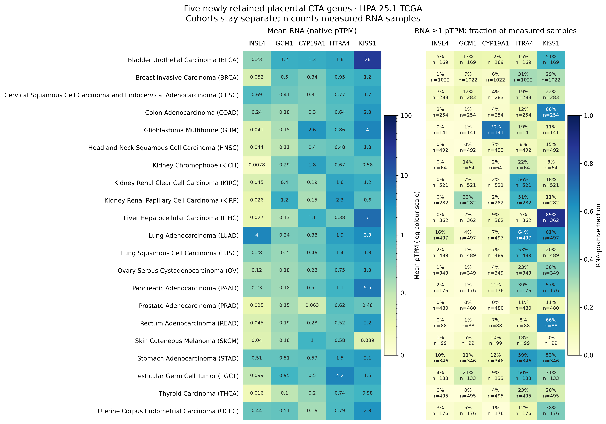
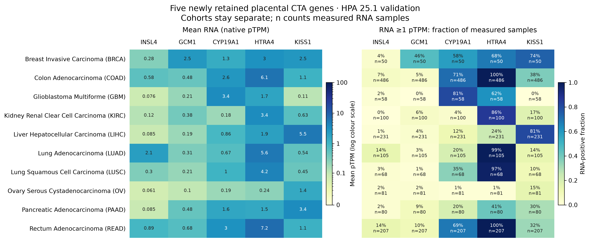
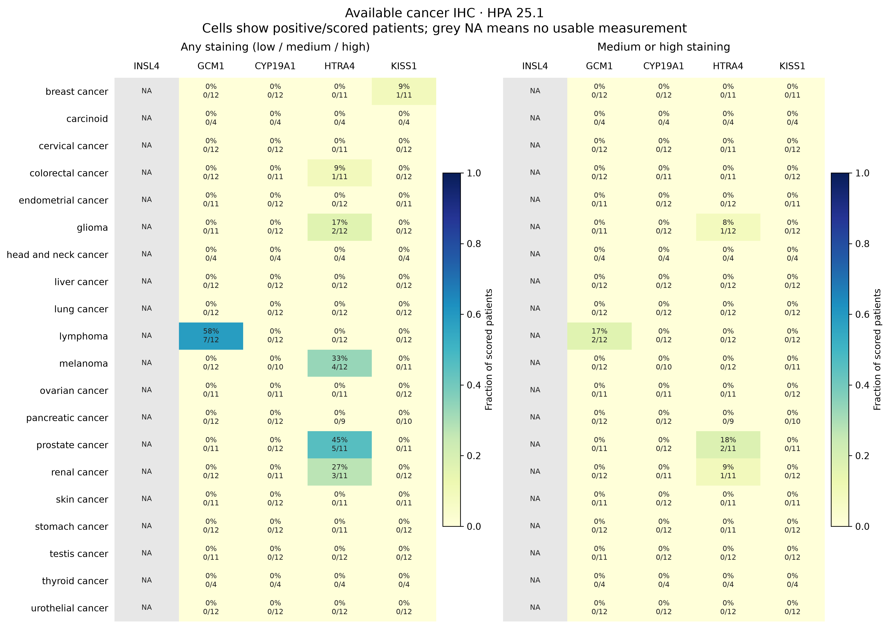
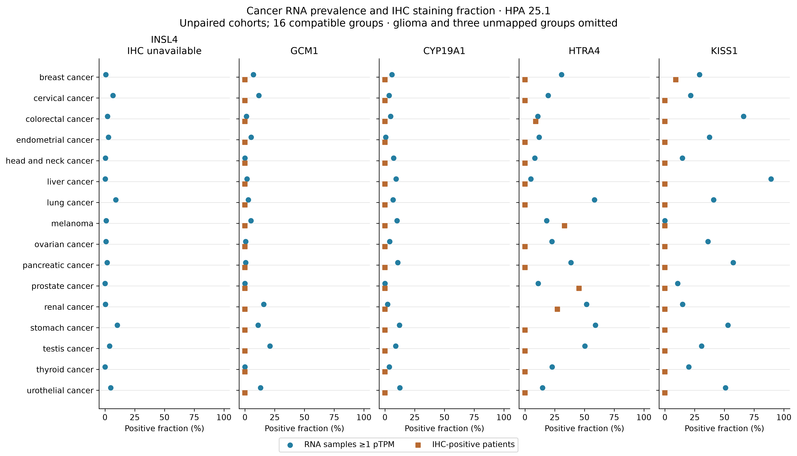

# Cancer RNA and IHC for the five new placental CTA genes

Gong/Bradley nominations add five genes to the default CTA panel: **INSL4,
GCM1, CYP19A1, HTRA4 and KISS1**. Their profiles use oncoref's SHA-pinned,
genome-wide **HPA 25.1** reference (native HPA Ensembl 109 IDs). The RNA release
has 21 TCGA and ten validation cancer types. All five genes have RNA rows in
both cohorts; the cohorts remain separate. RNA is native **pTPM**, without a
clean-TPM transformation.




## Available cancer IHC

Four genes have IHC across 20 cancer groups. **INSL4 has no cancer IHC row** in
this release; its grey NA column is missing evidence, not zero staining. Each
cell shows positive/scored patients. IHC fractions describe **scored patients,
not the fraction of cells stained**. Any staining includes low, medium and high;
the second panel restricts positives to medium/high. Small denominators (often
4–12 patients) are shown explicitly.



HTRA4 has the most widespread observed IHC among these five genes, including
prostate 5/11, melanoma 4/12 and renal cancer 3/11 with any staining. GCM1 has
7/12 positive lymphoma patients; lymphoma has no corresponding HPA RNA cohort.
CYP19A1 has no positive IHC observations in this aggregate. KISS1 has 1/11 breast
patients with low staining and no positive observations in the other groups,
despite higher RNA prevalence in several cancer types. These are observations
in separate cohorts, not paired assay sensitivity or specificity estimates.
The aggregate does not identify antibodies or establish paralog specificity.

## RNA versus IHC

Sixteen cancer groups have compatible anatomical RNA/IHC mappings. Colorectal,
lung and renal RNA pool measured-sample counts across all required component
types. IHC glioma is broader than the available GBM RNA, so it is not compared.
Carcinoid, lymphoma and skin cancer have no matched RNA group. Their IHC remains
visible above. INSL4 retains its RNA values in the comparison despite absent IHC.



## Reproduction

```sh
python -m pirlygenes.placental_gene_profiles --out analyses/outputs/run_<timestamp>/placental_profiles
pirlygenes plot cta-curation --out analyses/outputs/run_<timestamp>/cta_curation
```

Use the pinned `oncoref==1.8.204` environment. The profile command writes four
300-dpi PNG/vector-PDF pairs, all 155 RNA and 80 observed IHC rows, a 100-row
comparison retaining missing IHC, crosswalk and cohort metadata, assay cautions,
and `profile-provenance.json` containing owner version and raw/artifact hashes.

Sources: [HPA cancer data](https://www.proteinatlas.org/humanproteome/cancer/data),
[archived versioned source files](https://github.com/pirl-unc/oncoref/releases/tag/hpa-cancer-v25.1-1),
and [oncoref source/API documentation](https://github.com/pirl-unc/oncoref/blob/main/docs/hpa-cancer-reference.md).
